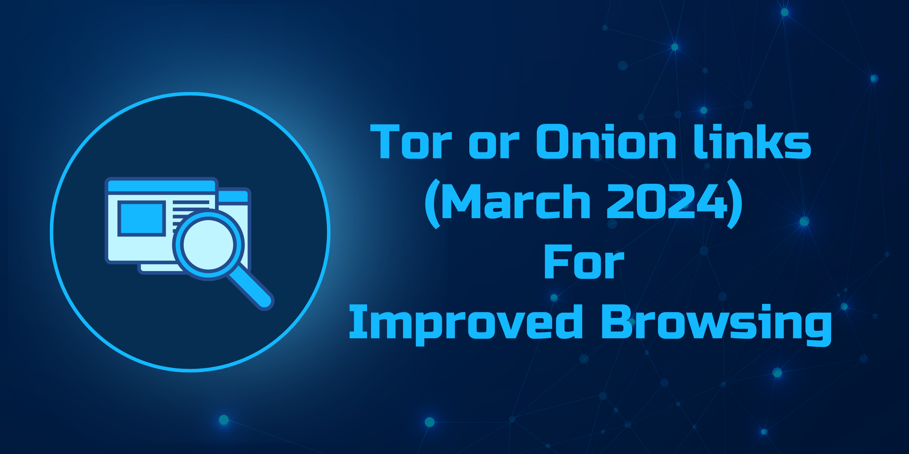

# The Hidden Wiki URLs 2024

> Discover an exclusive compilation of authenticated .onion URLs showcasing diverse Onion Services within the depths of the darknet.

<small> 

*This is a place for learning about the darkweb in a scientific and educational way. We don't make money from any market links. We're not connected to any official group and we don't promote anything illegal.*

</small>

## Contents

<!-- @import "[TOC]" {cmd="toc" depthFrom=1 depthTo=6 orderedList=false} -->

<!-- code_chunk_output -->

  - [Ahmia](#Ahmia)
  - [CashCow](#CashCow)
  - [CashMachine](#CashMachine)
  - [DuckDuckGo](#DuckDuckGo)
  - [Fish'n'Pal](#Fish'n'Pal)
  - [PremiumCards](#PremiumCards)
  - [TheGreenMachine](#TheGreenMachine)
  - [TheHiddenWiki](#TheHiddenWiki)
  - [USJUD](#USJUD)

<!-- /code_chunk_output -->

## Ahmia

- [Ahmia](http://juhanurmihxlp77nkq76byazcldy2hlmovfu2epvl5ankdibsot4csyd.onion) - `http://juhanurmihxlp77nkq76byazcldy2hlmovfu2epvl5ankdibsot4csyd.onion`

<a href="http://juhanurmihxlp77nkq76byazcldy2hlmovfu2epvl5ankdibsot4csyd.onion"><a>

## Contribute

Contributions are welcome!

<!-- Don't forget to add to bookmarks and distribute the repository to your friends. -->
